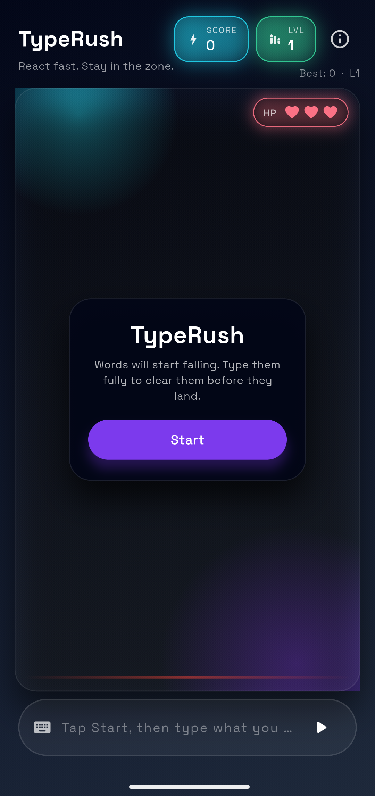

## TypeRush – Neon Typing Speed Game

TypeRush is a fast, neon‑styled typing game where random words fall from the top of the screen and you race to type them before they hit the danger line. The gameplay is simple but satisfying: clear words to score points, climb levels, and gradually increase the falling speed as you get into a typing flow.

### Core Features

- **Falling word gameplay**: Random words drop from the top of the playfield; type a word exactly to clear it before it reaches the bottom.
- **Progressive difficulty**: Words start falling slowly and speed up as you successfully type more, making each run more intense over time.
- **Score & level system**: Each cleared word adds to your score and helps you level up. Higher levels spawn and drop words faster.
- **Best score tracking**: Your highest score and level are stored locally on the device and displayed next to the current run to motivate you to beat your personal best.
- **Health (HP) bar**: Missed words cost you lives; lose all lives and the run ends.
- **Modern neon UI**: Dark, gradient background, glowing orbs, and animated word chips for a clean and modern arcade feel.
- **Custom in‑app splash**: A Flutter splash screen with TypeRush branding, followed by the main game.
- **Info & policies screen**: Dedicated page with Terms & Conditions, Privacy Policy, About Us, and app version.

### Tech & Structure

- **Framework**: Flutter (Dart), using Material 3 dark theme.
- **Animation / game loop**: Uses `Ticker` (`SingleTickerProviderStateMixin`) to update falling word positions each frame.
- **State & logic**:
  - `TypingGameScreen` – main game screen, manages ticker, spawning, scoring, levels, and HP.
  - `FallingWord` model – holds text, position, and speed.
  - Difficulty scales with level plus a per‑word speed multiplier.
- **Persistence**:
  - `shared_preferences` – stores best score and best level locally on the device.
  - `package_info_plus` – reads the app version to show in the info screen.
- **UI components**:
  - `SplashScreen` – intro screen with logo, tagline, and mini word chips.
  - `TypingGameScreen` – header, neon playfield, health bar, and input bar.
  - `InfoScreen` – terms, privacy, about, and footer branding.
  - `FallingWordChip` – glowing pill widget for each falling word.
  - `NeonOrb` – reusable glowing background orb.

### Project Layout (main pieces)

- `lib/main.dart` – app entry point, runs `TypeRushApp`.
- `lib/app/app.dart` – global theme and home navigation.
- `lib/app/splash_screen.dart` – animated in‑app splash.
- `lib/game/typing_game_screen.dart` – core game logic and layout.
- `lib/game/models/falling_word.dart` – falling word model.
- `lib/game/widgets/falling_word_chip.dart` – word chip widget.
- `lib/game/widgets/neon_orb.dart` – background orb widget.
- `lib/info/info_screen.dart` – info / policies / about us screen.

### Packages Used

- `google_fonts` – custom typography using Space Grotesk.
- `shared_preferences` – local storage for best score and level.
- `package_info_plus` – to read app version at runtime for display.
- `flutter_native_splash` – native splash customization (configured via `flutter_native_splash.yaml`).

### Screenshots



### Running the Game

```bash
flutter pub get
flutter run
```

The default target will run in debug mode. For a release build:

- Android APK:

```bash
flutter build apk --release
```

- Android App Bundle (for Play Store):

```bash
flutter build appbundle --release
```


